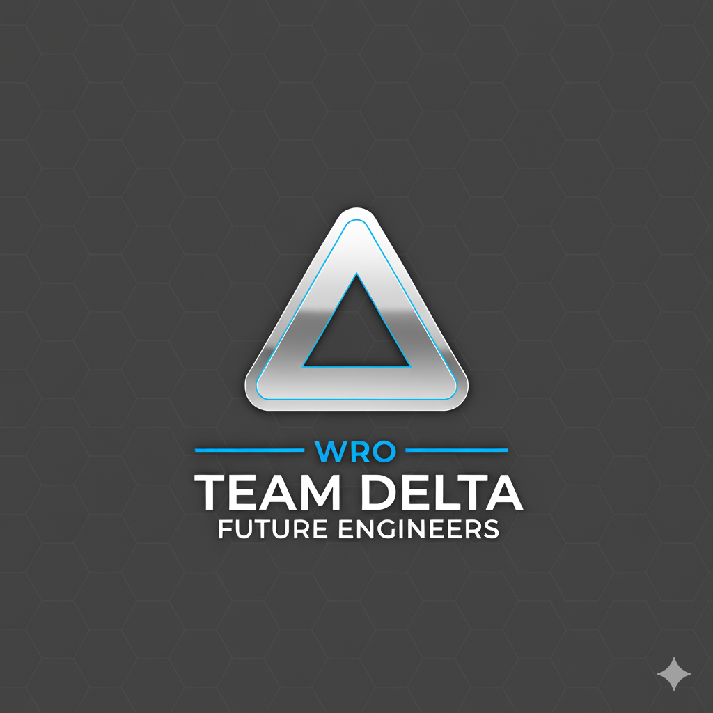
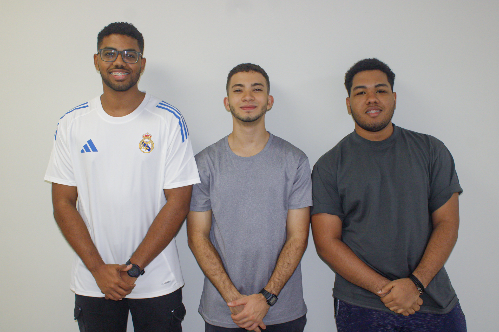
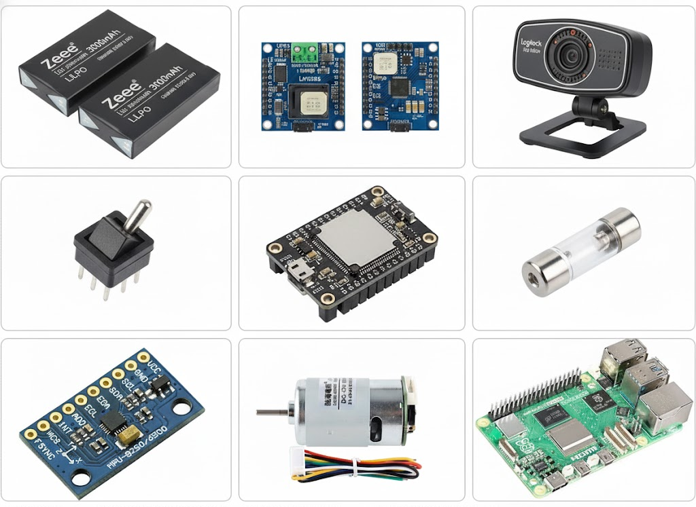
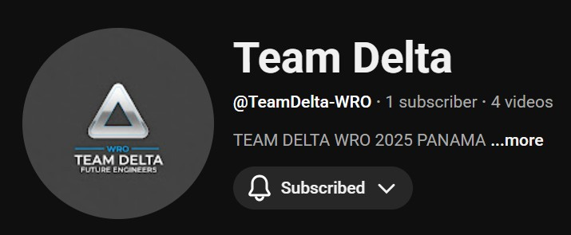
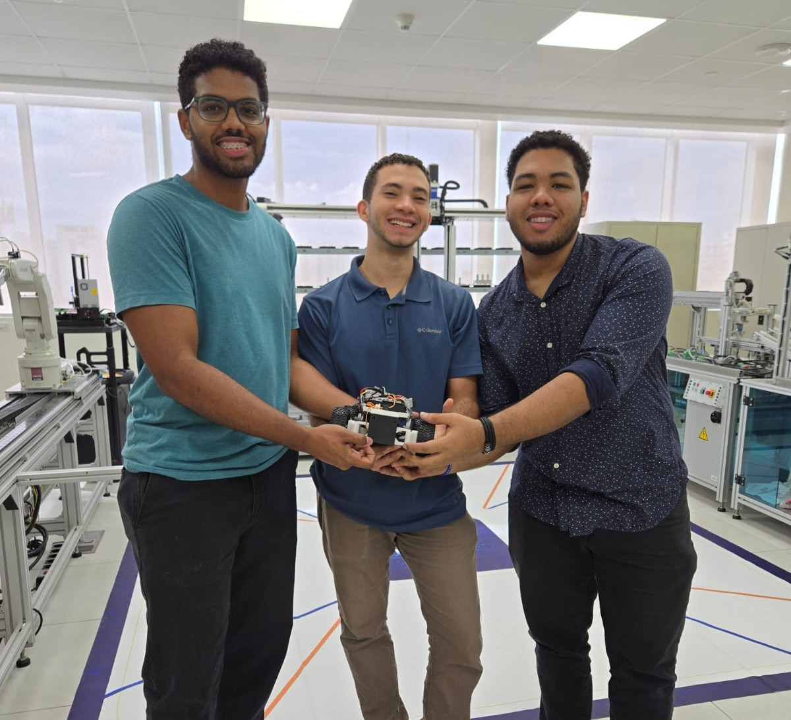
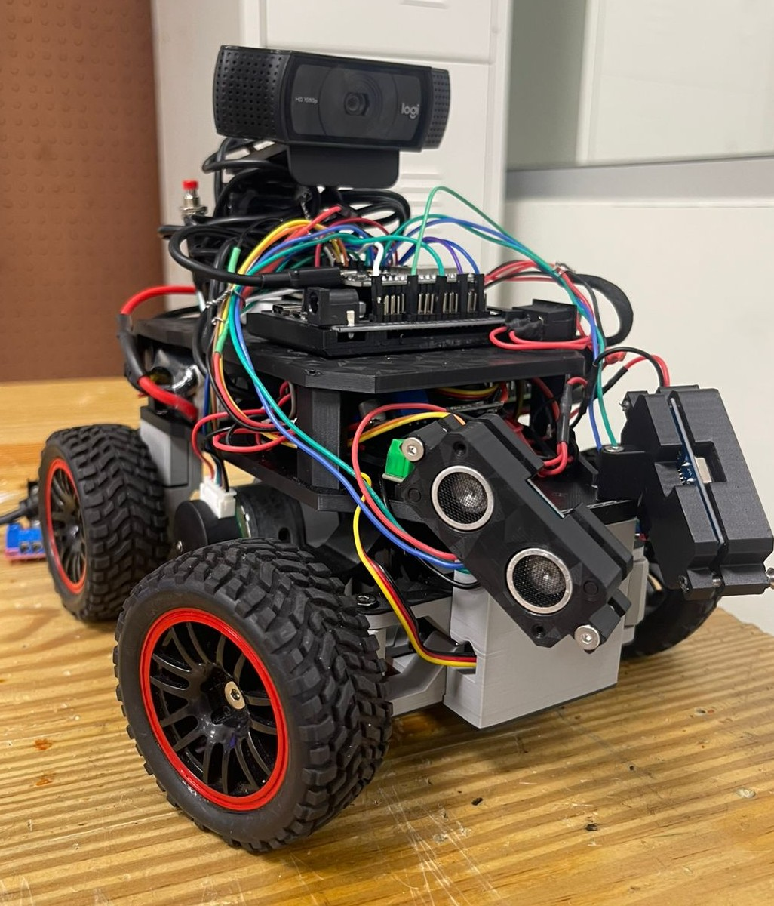

# TEAM DELTA — WRO 2025 (Future Engineers · Panama)

  

**Pontificia Universidad Católica Madre y Maestra (PUCMM) — Dominican Republic**  
Autonomous Vehicle Project for the **World Robot Olympiad 2025**, Future Engineers Category.

This repository documents the complete development of our robot — covering its **design, hardware, programming, and testing**.  

---

## Sections

## Sections

<h2><a href="other/team/README.md">About Us</a></h2>
Team members, coach, and individual responsibilities.  

<h2><a href="schemes/README.md">Hardware</a></h2>
Electronic components, wiring, power systems, and schematics.  

<h2><a href="models/README.md">3D Design</a></h2>
Mechanical structure, chassis layout, and design evolution.  

<h2><a href="src/README.md">Software</a></h2>
Control logic, firmware explanation, and system architecture.  

<h2><a href="videos/README.md">Videos</a></h2>
Test runs, internal trials, and WRO challenges.  

<h2><a href="t-photos/README.md">Team Photos</a></h2>
Official and funny team pictures.  

<h2><a href="v-photos/README.md">Vehicle Photos</a></h2>
Design and evolution of the robot through different versions.  

---

## Summary

**TEAM DELTA Δ** is committed to engineering excellence, innovation, and teamwork.  
This documentation serves as a transparent record of our journey to the **WRO 2025** stage,  
where mechanical design, electrical systems, and embedded control come together to build an autonomous vehicle capable of intelligent navigation.

---

*© 2025 TEAM DELTA – PUCMM · All rights reserved.*
