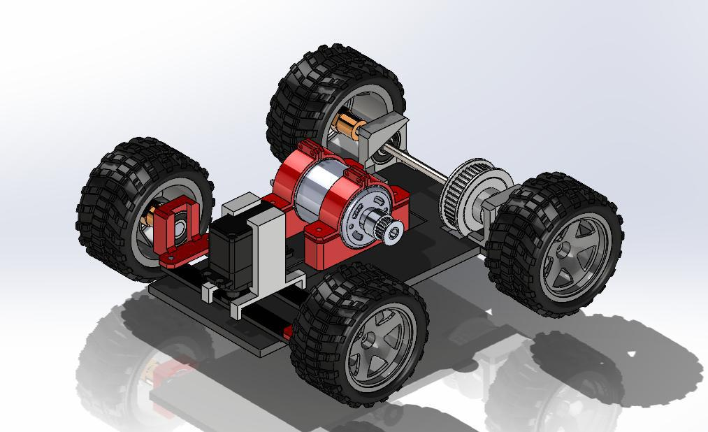
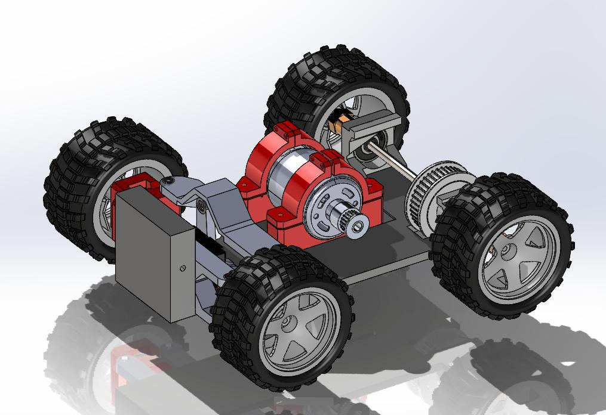

# 3D Design — Structure & Evolution (TEAM DELTA · WRO 2025)

This section documents the robot’s mechanical structure and its evolution from early prototypes to the current competition-ready design.

---

## Index

1. [Overview](#overview)
2. [Structure Overview (Two Floors)](#structure-overview-two-floors)
   - [First Floor](#first-floor)
   - [Second Floor](#second-floor)
3. [CAD Assets and Printing](#cad-assets-and-printing)
4. [Robot Design Evolution](#robot-design-evolution)
   - [Version V1](#version-v1)
   - [Version V2](#version-v2)
   - [Version V3](#version-v3)
   - [Version V4](#version-v4)
   - [Note on V4–V6 Changes](#note-on-v4v6-changes)
   - [Version V6.5](#version-v65)
5. [Summary](#summary)

---

## Overview

The 3D design of Team Delta’s robot was developed with a focus on modularity, serviceability, and lightweight performance.  
Each prototype iteration aimed to improve mechanical strength, cable routing, and sensor integration while maintaining compliance with WRO Future Engineers regulations.

---

## Structure Overview (Two Floors)

The current build uses a two-floor modular chassis, which simplifies assembly, maintenance, and weight distribution.  
Earlier versions used a three-floor layout that has since been consolidated for efficiency.

### First Floor
- Drivetrain: DC motors (RS555), wheel hubs, and steering (Ackermann geometry).  
- Actuation Electronics: DRV8871 motor drivers, high-current wiring, and fuses.  
- Front Module: ultrasonic sensor mounts (front, left, right) and structural guards.  
- Mechanical: reinforced servo horn and chassis stiffeners.

### Second Floor
- Control and Power: ESP32 controller, voltage regulators (LM2596/HW-083), LiPo battery, and main power switch.  
- Vision System: Raspberry Pi 5 and Logitech C920 camera mount.  
- Wiring Management: organized cable channels and labeled access points.

---

## CAD Assets and Printing

All CAD assets are stored in the [`models/`](../models/) directory and organized by version (V1–V6.5).

Printing Recommendations:
- Infill: 20–35% depending on stress load.  
- Materials: PETG or ABS for structural parts; PLA for brackets and cable holders.  
- Orientation: print motor and servo mounts with layers aligned to torque direction.

---

## Robot Design Evolution

Below is the evolution of Team Delta’s robot, from its first concept to the current two-floor structure.

---

### Version V1
The initial prototype, created to test drivetrain and steering feasibility.  
Flat, single-level chassis with basic motor and servo mounts.

---

### Version V2
Added partial enclosures and a more rigid front structure for the servo and motor assembly.  
Refined wheel positioning and introduced the first servo linkage mechanism.

---

### Version V3
Introduced a thicker mid-frame for higher rigidity and improved torque transmission.  
Optimized rear axle and pulley system.  
Used color-coded components for easier identification during assembly.

---

### Version V4
A fully functional mechanical prototype with accurate Ackermann geometry.  
Featured rugged wheels, a more stable servo mount, and the first differential system for improved traction.

---

### Note on V4–V6 Changes
Versions V4, V5, and V6 mainly included:
- minor dimensional adjustments,  
- improved cable routing,  
- refined mounting hole alignment.  

These versions served as transitional steps leading to the final V6.5 model.

---

### Version V6.5
Adopted a multi-floor modular structure, separating mechanical, electrical, and computational layers.  
Included mounting for the Raspberry Pi 5, ESP32, motor drivers, and sensors in dedicated compartments.  
The frame includes integrated wire channels and reinforced brackets for improved serviceability.

---

## Summary

From V1 to V6.5, Team Delta’s robot evolved into a compact, modular, and competition-ready platform.  
Each design phase focused on:
- reducing weight and complexity,  
- improving wiring and accessibility,  
- enhancing mechanical reliability.  

This iterative approach reflects the team’s commitment to engineering precision and continuous improvement.

---
