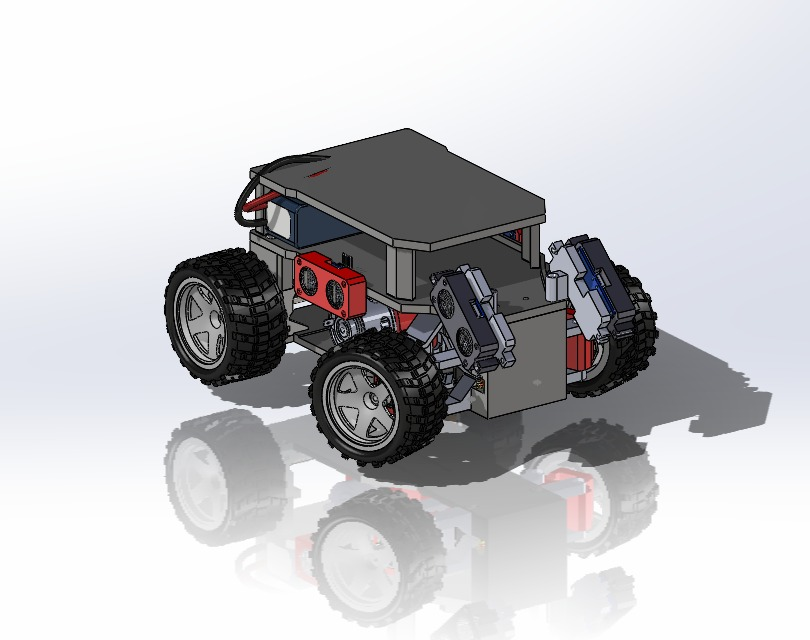

## Robot Design Evolution

This section showcases the **evolution of TEAM DELTA’s robot design**, from the very first mechanical prototype to the latest integrated version prepared for autonomous testing.  
Each stage demonstrates improvements in structure, balance, electronics integration, and overall system efficiency — reflecting the team’s continuous optimization process.

---

## Version 1 (V1)

The **first prototype** focused primarily on the **mechanical foundation and traction system** of the vehicle.  
At this stage, the design included a **simple frame** with a single DC motor mounted on a **metal support**, used to validate the basic drivetrain configuration.  
The purpose of V1 was to verify **axle alignment, transmission efficiency**, and **structural rigidity** under initial motion tests.  

No electronic modules or sensors were included yet — this prototype served as the **core mechanical proof of concept**.  
It helped the team understand torque distribution, friction losses, and the required power to achieve stable straight-line motion before integrating more advanced components.

---

## Version 2 (V4)

The **second major iteration (V4)** introduced significant mechanical refinements and structural improvements.  
This version incorporated **four fully functional wheels**, connected through an upgraded **axle and gear system**, designed for improved torque balance and smoother motion.  

A **modular frame** was implemented, allowing rapid adjustments of the **motor position**, **axle supports**, and **servo linkages**.  
Weight distribution and the **center of gravity** were carefully optimized to enhance **stability**, particularly during turning and acceleration.  

The improved structural symmetry and reinforced chassis reduced vibrations and lateral drift, making V4 a **milestone version** in achieving consistent mechanical performance.

---

## Version 3 (V6.5)

The **third and most advanced version (V6.5)** represents the transition to a **fully integrated mechatronic platform**.  
This iteration introduced a dedicated **electronics control board**, organized **cable routing**, and **sensor mounts** for the front modules.  

The chassis was redesigned to be **more compact and layered**, providing specific areas for the **battery**, **controller**, and **camera or distance sensors**.  
This version combines mechanical robustness with clean electronic integration, marking the first time the system was ready for **autonomy, telemetry, and algorithm testing**.  

With improved accessibility, modular spacing, and a clear layout for expansion, V6.5 stands as the foundation for the team’s final **competition-ready design** — compact, efficient, and easy to maintain.

---

## Version 4 (V7)

The **final version (V7)** showcases the **complete integration** of mechanical, electrical, and software subsystems, making it the team’s **competition-ready robot**.  
This design focuses on **system reliability**, **cable management**, and **sensor calibration** for autonomous operation under WRO conditions.  

The chassis now includes a **better mount for the camera** with a better and wider view of the field, beter **component positioning**, and **adjustable mounts** for ultrasonic units.  

Additionally, this version introduced **fans** to optimize cooling a new  power switch just for the Raspberry Pi so we can control both power sources independently.

V7 stands as the **culmination of iterative testing, engineering precision, and team collaboration**, ready to represent Team Delta at the **WRO 2025 Future Engineers** competition in Panama.

---

Each iteration — from V1 to V7 — represents a clear evolution in **engineering maturity**, moving from mechanical experimentation to an integrated, intelligent robotic system.  
The process highlights the importance of **incremental design, testing, and optimization** in achieving a stable and reliable autonomous platform.
