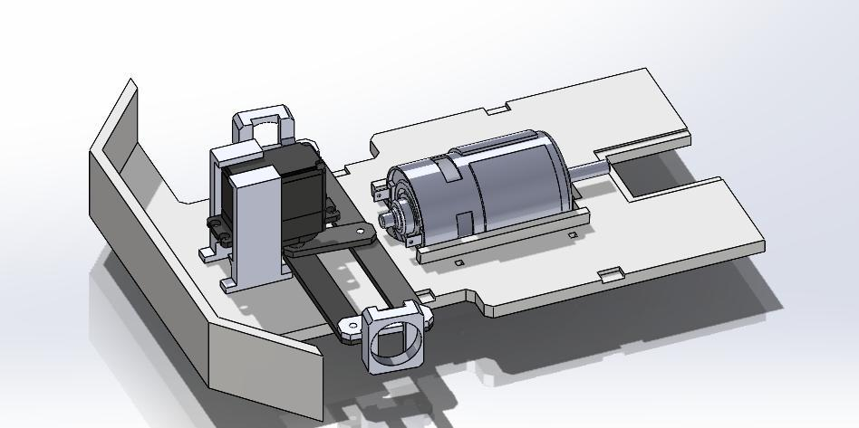
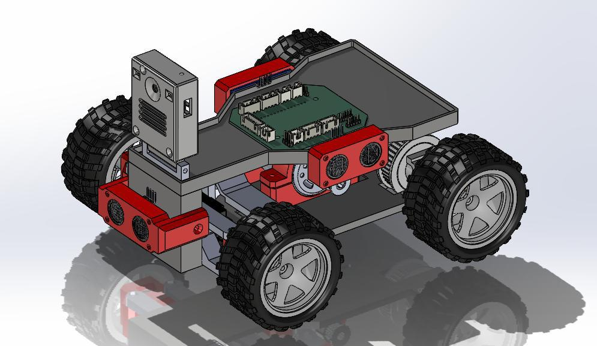
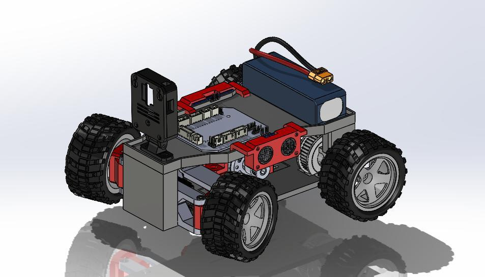

# 3D Design — Structure & Evolution

This section documents the robot’s mechanical structure and its evolution from early prototypes to the current competition-ready design.

---

## Index

1. [Overview](#overview)
2. [Structure Overview (Two Floors)](#structure-overview-two-floors)
   - [First Floor](#first-floor)
   - [Second Floor](#second-floor)
3. [CAD Assets and Printing](#cad-assets-and-printing)
4. [Robot Design Evolution](#robot-design-evolution)
   - [Version V1](#version-1-v1)
   - [Version V4](#version-2-v4)
   - [Version V6.5](#version-3-v65)
5. [Summary](#summary)

---

## Overview

The 3D design of Team Delta’s robot was developed with a focus on modularity, serviceability, and lightweight performance.  
Each prototype iteration aimed to improve mechanical strength, cable routing, and sensor integration while maintaining compliance with WRO Future Engineers regulations.

---

## Structure Overview (Two Floors)

The current build uses a two-floor modular chassis, which simplifies assembly, maintenance, and weight distribution.  
Earlier versions used a three-floor layout that has since been consolidated for efficiency.

### First Floor

- Drivetrain: DC motors (RS555), wheel hubs, and steering (Ackermann geometry).  
- Actuation Electronics: DRV8871 motor drivers, high-current wiring, and fuses.  
- Front Module: ultrasonic sensor mounts (front, left, right) and structural guards.  
- Mechanical: reinforced servo horn and chassis stiffeners.

### Second Floor

- Control and Power: ESP32 controller, voltage regulators (LM2596/HW-083), LiPo battery, and main power switch.  
- Vision System: Raspberry Pi 5 and Logitech C920 camera mount.  
- Wiring Management: organized cable channels and labeled access points.

---

## CAD Assets and Printing

All CAD assets are stored in the [`models/`](../models/) directory and organized by version (V1–V6.5).

Printing Recommendations:

- Infill: 25–35% depending on stress load.  
- Materials: ASA for coupling parts; PLA for the rest.  

---

## Robot Design Evolution

This section showcases the **evolution of TEAM DELTA’s robot design**, from the very first mechanical prototype to the latest integrated version prepared for autonomous testing.  
Each stage demonstrates improvements in structure, balance, electronics integration, and overall system efficiency — reflecting the team’s continuous optimization process.

---

## Version 1 (V1)

The **first prototype** focused primarily on the **mechanical foundation and traction system** of the vehicle.  
At this stage, the design included a **simple frame** with a single DC motor mounted on a **metal support**, used to validate the basic drivetrain configuration.  
The purpose of V1 was to verify **axle alignment, transmission efficiency**, and **structural rigidity** under initial motion tests.  

No electronic modules or sensors were included yet — this prototype served as the **core mechanical proof of concept**.  
It helped the team understand torque distribution, friction losses, and the required power to achieve stable straight-line motion before integrating more advanced components.

---

## Version 2 (V4)

The **second major iteration (V4)** introduced significant mechanical refinements and structural improvements.  
This version incorporated **four fully functional wheels**, connected through an upgraded **axle and gear system**, designed for improved torque balance and smoother motion.  

A **modular frame** was implemented, allowing rapid adjustments of the **motor position**, **axle supports**, and **servo linkages**.  
Weight distribution and the **center of gravity** were carefully optimized to enhance **stability**, particularly during turning and acceleration.  

The improved structural symmetry and reinforced chassis reduced vibrations and lateral drift, making V4 a **milestone version** in achieving consistent mechanical performance.

---

## Version 3 (V6.5)

The **third and most advanced version (V6.5)** represents the transition to a **fully integrated mechatronic platform**.  
This iteration introduced a dedicated **electronics control board**, organized **cable routing**, and **sensor mounts** for the front modules.  

The chassis was redesigned to be **more compact and layered**, providing specific areas for the **battery**, **controller**, and **camera or distance sensors**.  
This version combines mechanical robustness with clean electronic integration, marking the first time the system was ready for **autonomy, telemetry, and algorithm testing**.  

With improved accessibility, modular spacing, and a clear layout for expansion, V6.5 stands as the foundation for the team’s final **competition-ready design** — compact, efficient, and easy to maintain.

---

## Summary

Each iteration — from V1 to V6.5 — represents a clear evolution in **engineering maturity**, moving from mechanical experimentation to an integrated, intelligent robotic system.  
The process highlights the importance of **incremental design, testing, and optimization** in achieving a stable and reliable autonomous platform.
