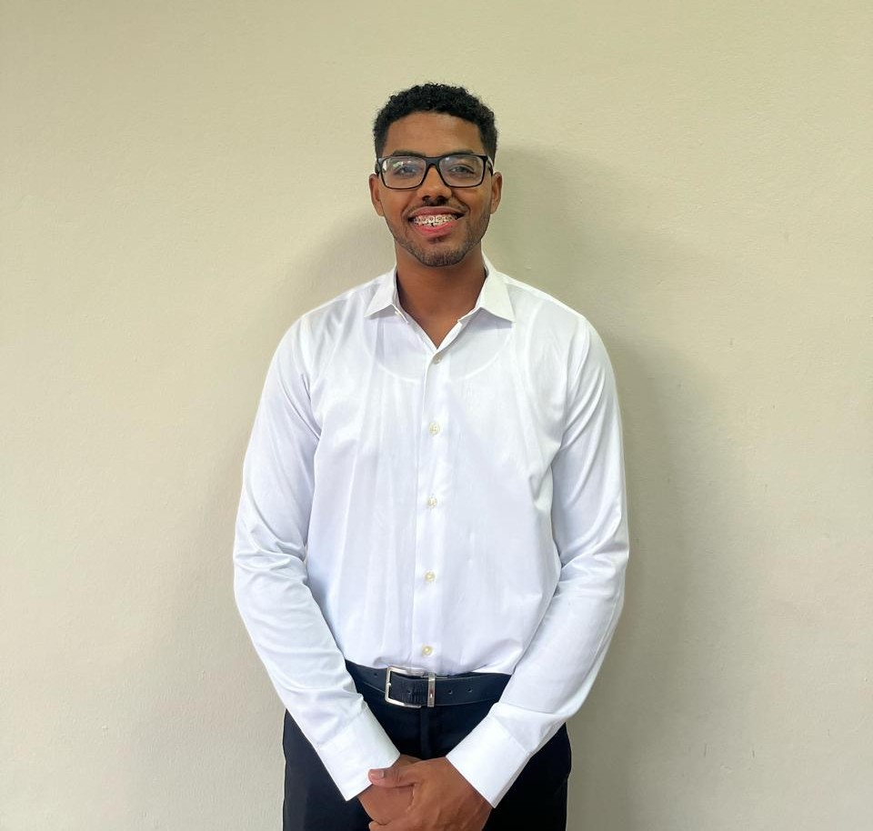
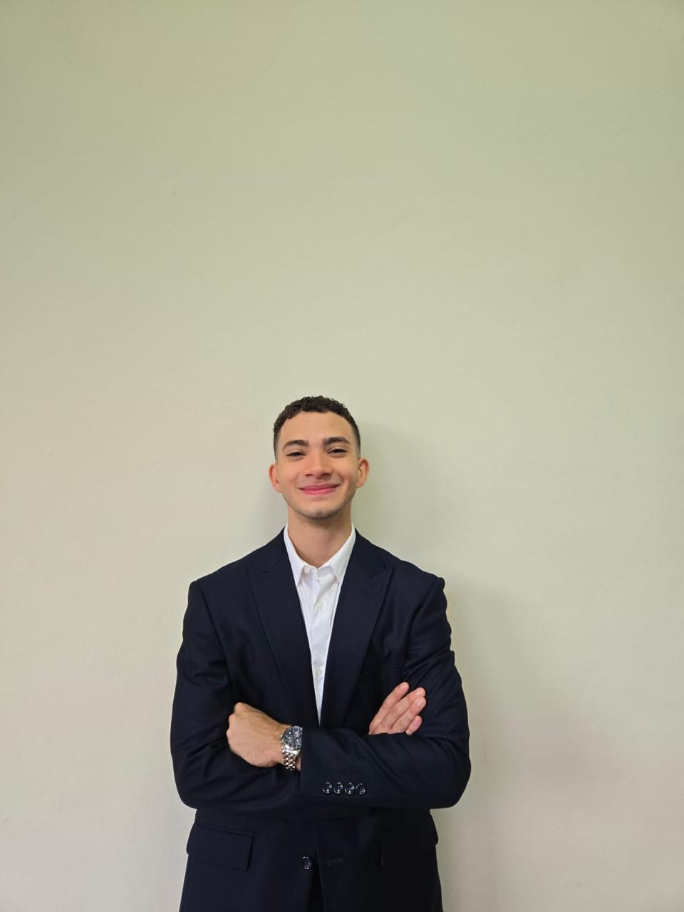
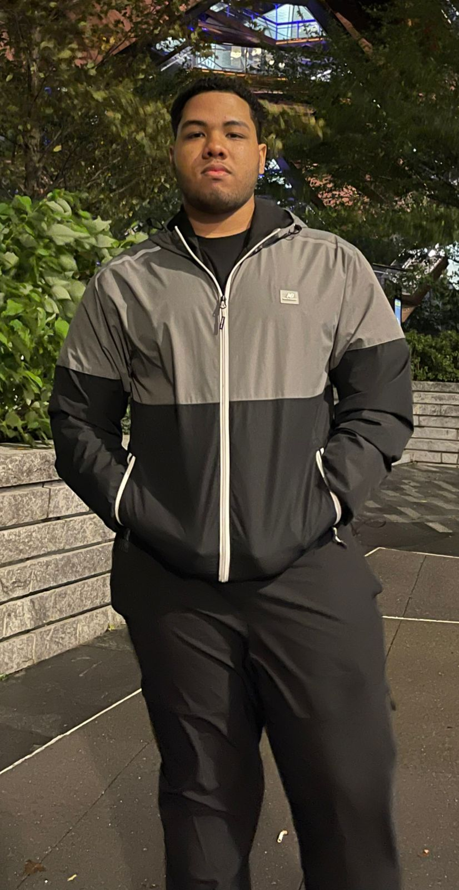
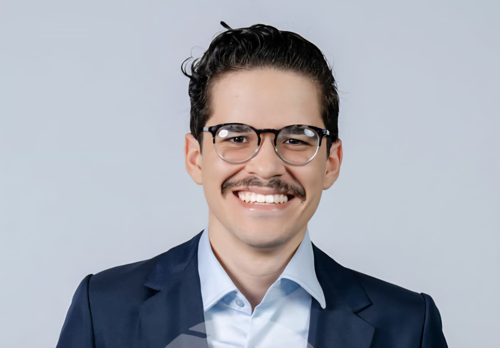

# About Us — Team Delta Δ

## Team Members — Pontificia Universidad Madre y Maestra (PUCMM)

<table>
  <tr>
    <td></td>
    <td></td>
    <td></td>
  </tr>
  <tr>
    <td><b>Ángel Veloz</b></td>
    <td><b>Luis Lockward</b></td>
    <td><b>Pedro Pérez</b></td>
  </tr>
</table>

 

 
<b>Álvaro Zapata — Coach</b>

---

> Emails  
> - Ángel Veloz — angelvelozsan1506@gmail.com  
> - Luis Lockward — luislockward@gmail.com  
> - Pedro Pérez — pedrojosepw@gmail.com  
> - Coach — alvarozapatazr@gmail.com  

---

## Roles & Responsibilities

### Ángel Veloz — Electrical Assembly & Circuit Design

Responsible for **electrical system design and integration**. Developed **PCB layouts**, power distribution, and wiring with **ESP32-WROVER**, **ToF/ultrasonic sensors**, and **MPU6050**. Ensures stable communications, power integrity, and sensor coordination.

---

### Luis Lockward — Mechanical Design & CAD Assembly

Leads **mechanical structure design and assembly** using CAD. Focus on a **lightweight, modular chassis** optimized for stability, maintenance, and compliance with WRO constraints. Oversees manufacturing and fit checks.

---

### Pedro Pérez — Programming & Control Systems

In charge of **software development and control logic** on the ESP32 (C++). Integrates sensors, motor control, and decision making. Optimizes **PID**, task scheduling, and module communications for autonomous behavior with Raspberry Pi (Python).

---
