# Hardware

This section covers the **electronics, components (BOM), power**, and **schematics**.

---

## Bill of Materials (BOM)

| **Component** | **Qty** | **Notes** |
|----------------|---------|-----------|
| [Raspberry Pi 5 (16 GB)](https://www.amazon.com/-/es/SC1113-Raspberry-Pi-5-16GB/dp/B0DSPYPKRG/ref=sr_1_1?sr=8-1) | 1 | Companion computer for vision & AI tasks |
| [ESP32](https://www.amazon.com/-/es/ESP-WROOM-32-Desarrollo-Microcontrolador-Procesador-Compatible/dp/B08D5ZD528/ref=sr_1_3) | 1 | Main MCU, 3.3 V logic |
| [Logitech C920 Webcam](https://www.amazon.com/-/es/Logitech-correcci%C3%B3n-funciona-Facetime-port%C3%A1til/dp/B085TFF7M1/ref=sr_1_1?sr=8-1) | 1 | 1080p video input for vision processing |
| [HC-SR04 Ultrasonic Sensor](https://www.amazon.com/-/es/ultras%C3%B3nico-HC-SR04-distancia-Mega2560-Conjunto/dp/B01COSN7O6/ref=sr_1_4?sr=8-4) | 3 | Front, Left, Right (Echo shifted to 3.3 V) |
| [DRV8871 H-Bridge driver](https://www.amazon.com/-/es/Teyleten-DRV8871-controlador-H-puente-m%C3%B3dulo/dp/B0DN66P9XW/ref=sr_1_3?sr=8-3) | 2 | One per DC motor |
| [HS-485HB Servo (steering)](https://www.amazon.com/-/es/HS-485HB-Est%C3%A1ndar-Anal%C3%B3gico-Karbonite-Aircraft/dp/B0F9YB8P4B/ref=sr_1_2?sr=8-2) | 1 | 5–6 V supply, high torque |
| [DC Motor 12 V (RS555 model)](https://www.ebay.com/itm/155702183252?_skw=motor+encoder+r555+12v) | 2 | RS555 brushed motor |
| [MPU6050 (I2C)](https://www.amazon.com/giroscopio-magn%C3%A9tico-aceleraci%C3%B3n-acelerador-magnet%C3%B3metro/dp/B01I1J0Z7Y/ref=sr_1_2_sspa?sr=8-2-spons) | 1 | IMU (gyro + accel) |
| [LiPo Battery 11.4 V 3000 mAh](https://www.ebay.com/itm/395464923168?_skw=zeee+11.4v+lipo+3s+3000mah) | 1 | XT60 recommended |
| [LM2596 / HW-083 step-down regulator](https://www.amazon.com/convertidor-reguladores-ajustables-recomendado-alimentaci%C3%B3n/dp/B0FDB25T5L/ref=sr_1_1_sspa?sr=8-1-spons) | 2+ | 12→6 V (servo) and 12→5/3.3 V (logic) |
| [Main switch](https://www.amazon.com/interruptor-basculante-encendido-precableado-autom%C3%B3vil/dp/B07S2QJKTX/ref=sr_1_2_sspa?sr=8-2-spons) + [Fuses](https://www.amazon.com/-/es/0-197x0-787-0-2x0-78-pulgadas-F1-6AL250V-Fusibles/dp/B07V288K4L/ref=sr_1_16?sr=8-16) | 1 set | Safety |

> **Tip:** Always maintain a **common GND** across battery, drivers, sensors, and MCU.

---

## Key Modules

### Raspberry Pi 5 (16 GB)

  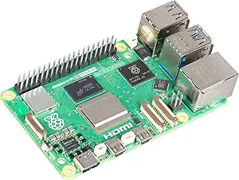 
  <em>The Raspberry Pi 5 serves as the companion computer for AI and computer vision tasks. 
  It communicates with the ESP32 via UART, I2C, or Ethernet for real-time data exchange. 
  Capable of running OpenCV, TensorFlow, and SLAM algorithms for perception and control.</em>

---

### ESP32 Controller

  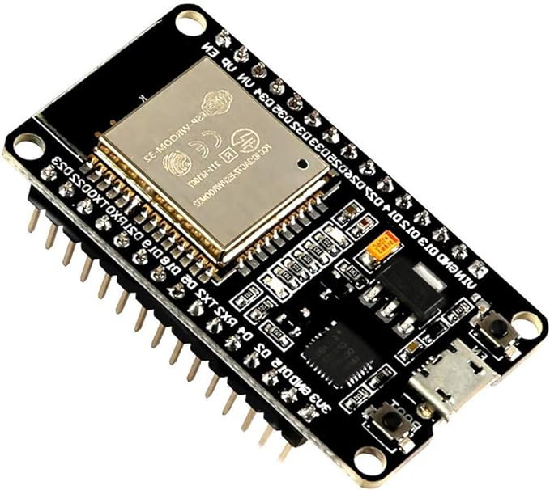 
  <em>The ESP32 functions as the main MCU, managing motor control, sensors, and communications. 
  Its dual-core architecture enables reliable real-time performance and parallel task execution.</em>

| Feature | Value |
|--|--|
| Cores | Xtensa LX6 dual-core |
| Voltage | 3.3 V |
| I/O Pins | 30+ |
| PWM (LEDC) | Yes |
| Flash | 4 MB |

---

### Camera (Logitech C920)

  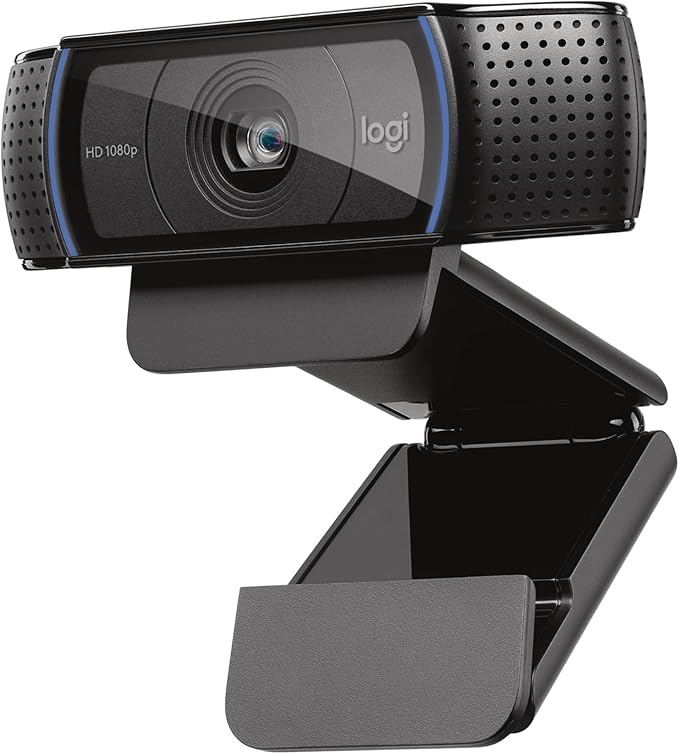 
  <em>A 1080p USB camera used by the Raspberry Pi for lane and object detection. 
  Provides clear video input under different lighting conditions for AI vision processing.</em>

---

### Ultrasonic Sensor (HC-SR04)

  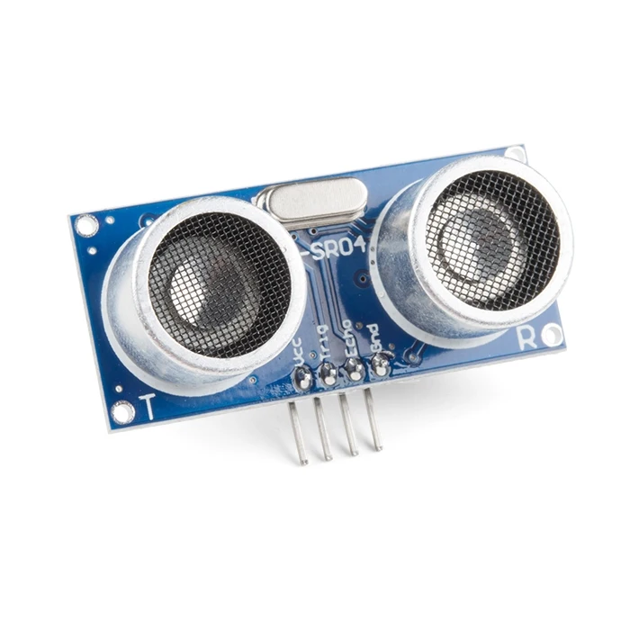 
  <em>Three ultrasonic modules are mounted front, left, and right to measure obstacle distance. 
  Each runs at 5 V (with 3.3 V logic shift) and 30 ms timeout for safe navigation.</em>

---

### H-Bridge (DRV8871)

  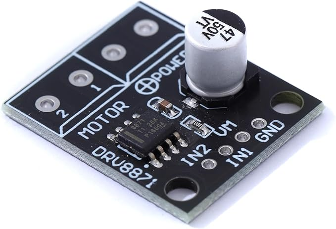 
  <em>The DRV8871 controls each 12 V DC motor via PWM signals, allowing bidirectional rotation. 
  Supports current limiting and thermal protection for safe operation.</em>

---

### Servo (HS-485HB)

  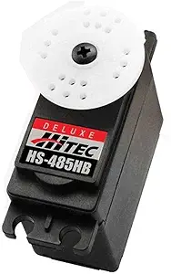 
  <em>The HS-485HB servo controls Ackermann steering using a dedicated 5–6 V supply (≥ 2 A). 
  Durable Karbonite gears ensure smooth and responsive direction control.</em>

---

### DC Motor (RS555 Model)

  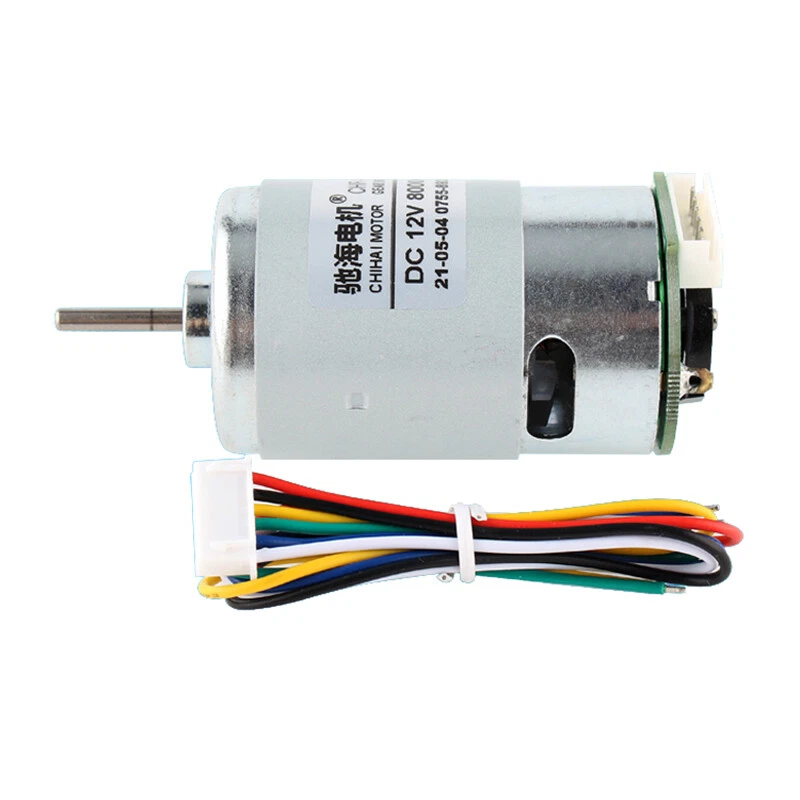 
  <em>Two RS555 12 V brushed DC motors drive the rear wheels through H-Bridges. 
  Provide high torque and stable speed under load conditions.</em>

---

### IMU (MPU6050)

  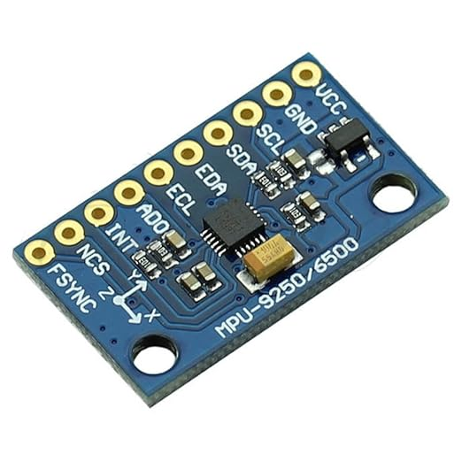 
  <em>The MPU6050 combines a 3-axis accelerometer and gyroscope to detect orientation and motion. 
  Sends I2C data to the ESP32 for stability and trajectory correction.</em>

---

### Battery (LiPo 11.4 V 3000 mAh)

  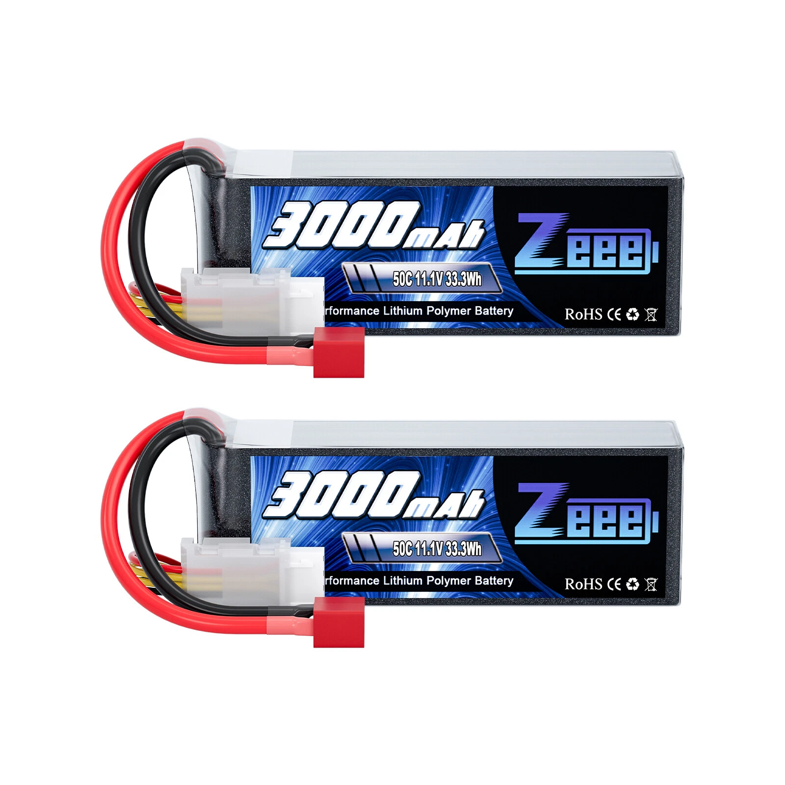 
  <em>A 3-cell LiPo battery powers all components with 11.4 V nominal voltage and XT60 connector. 
  Protected by inline fuses for safety and stable current delivery.</em>

---

### Step-Down Regulator (LM2596)

  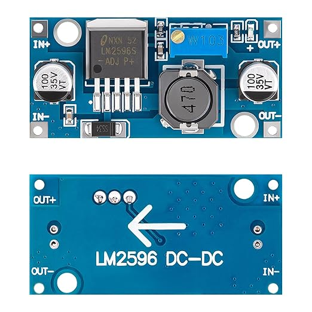 
  <em>LM2596/HW-083 buck converters step 12 V down to 6 V (for servo) and 5/3.3 V (for logic). 
  Include adjustable outputs and thermal protection for reliable voltage regulation.</em>

---

### Main Switch & Fuses

  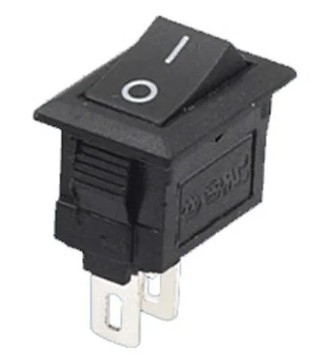
  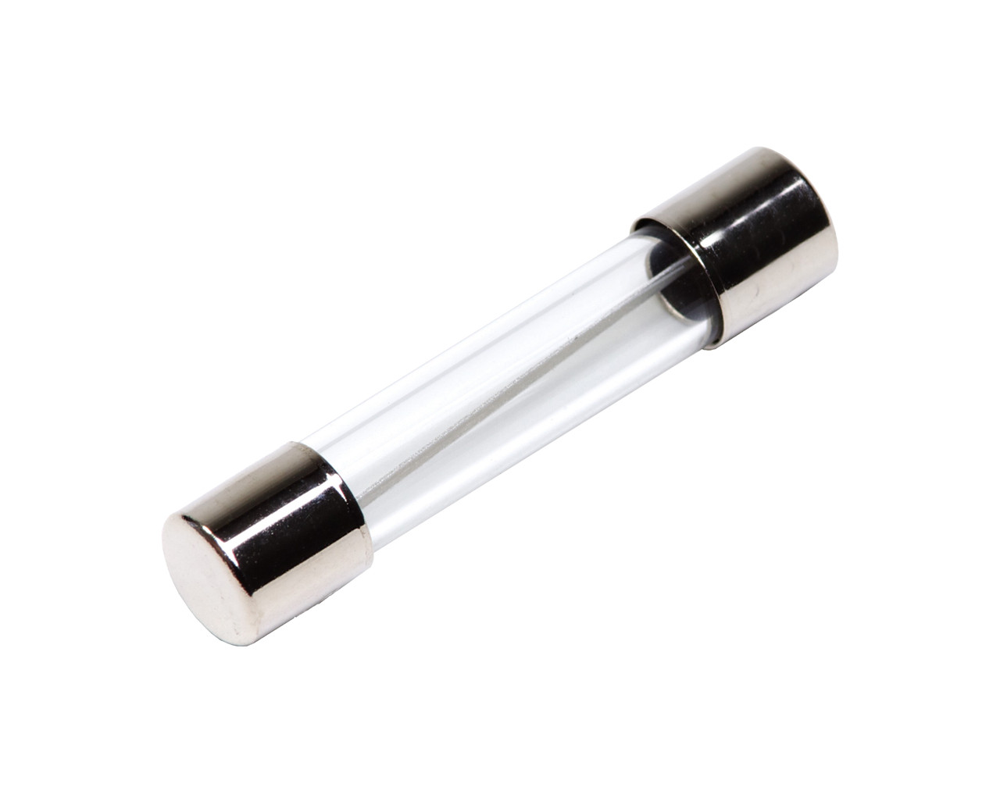

  <em>Main power switch with inline fuses ensures safe system startup and over-current protection. 
  Provides fast disconnect during maintenance or emergency shutdown.</em>

---

## Schematics

- [Delta Schematic Design (PDF)](../schemes/Delta%20schematic%20design.pdf)

**Preview**

   
  <em>This diagram shows the ESP32, DRV8871 drivers, Raspberry Pi, C920 camera, sensors, servo, regulators, and power distribution.</em>

---
